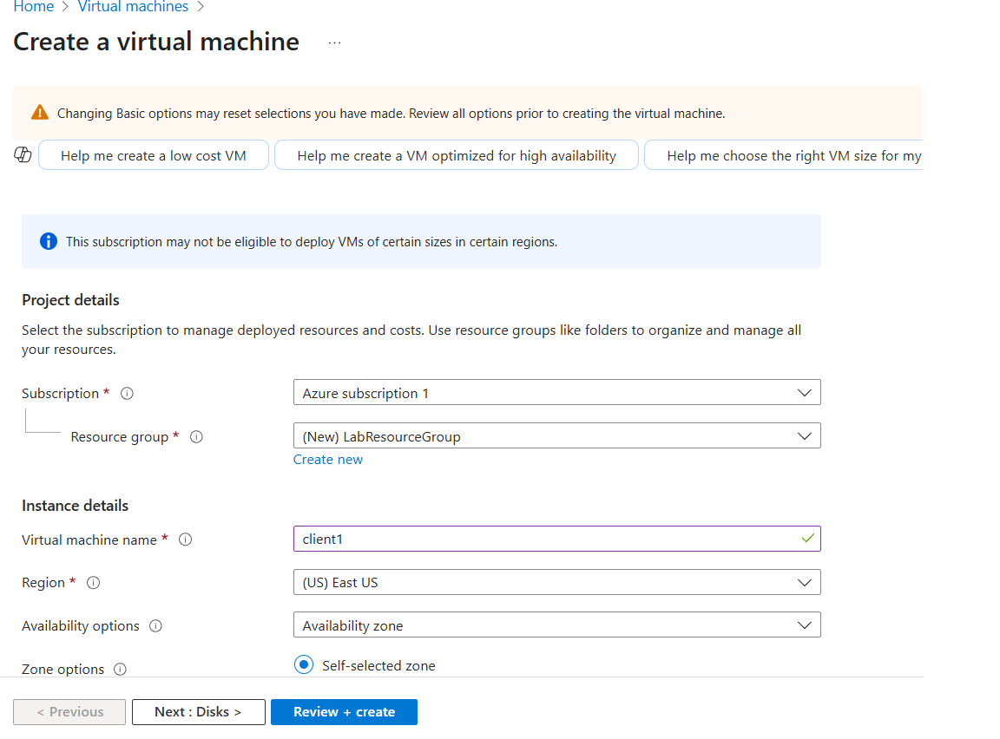
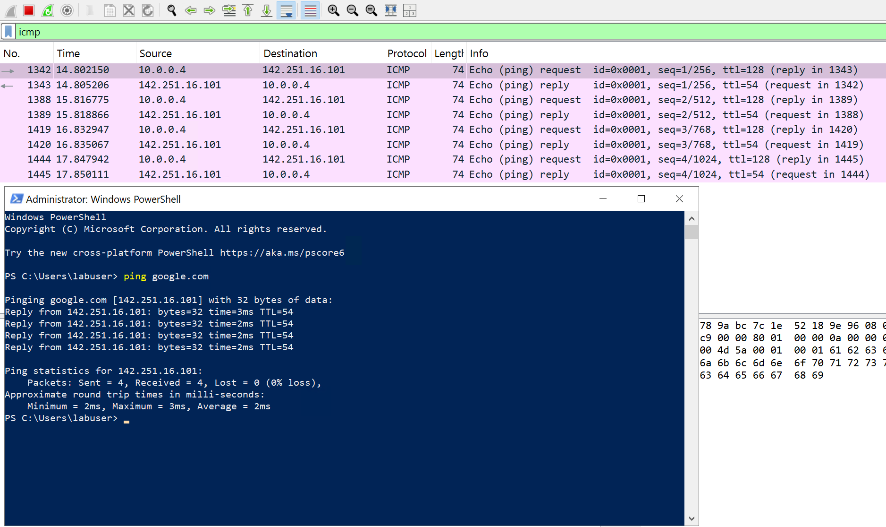
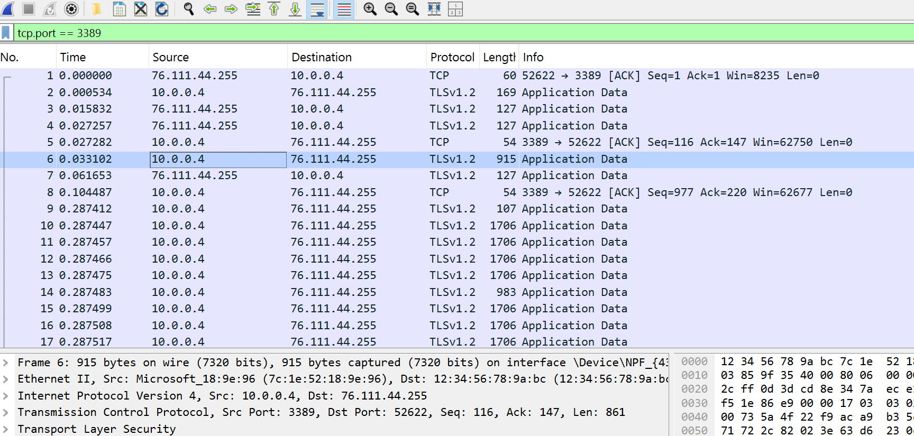
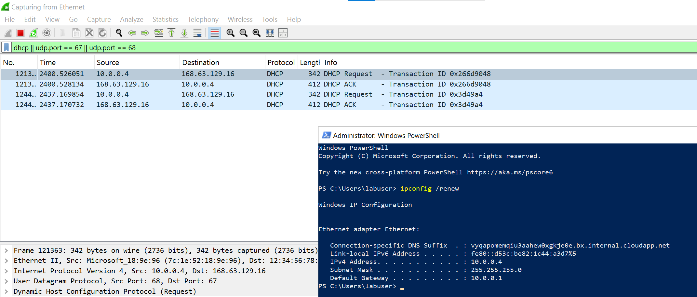
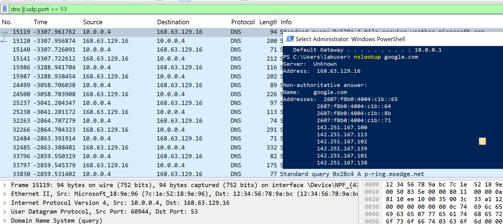

<h1>Network Security Groups (NSGs) and Inspecting Traffic Between Azure Virtual Machines</h1>
In this tutorial, we observe various network traffic to and from Azure Virtual Machines with Wireshark as well as experiment with Network Security Groups.  

<h2>Video Demonstration</h2>

- ### [YouTube: Azure Virtual Machines, Wireshark, and Network Security Groups](https://www.youtube.com)

<h2>Environments and Technologies Used</h2>

- Microsoft Azure (Virtual Machines/Compute)
- Remote Desktop
- Various Command-Line Tools
- Various Network Protocols (SSH, RDH, DNS, HTTP/S, ICMP)
- Wireshark (Protocol Analyzer)

<h2>Operating Systems Used </h2>

- Windows 10 (21H2)
- Ubuntu Server 20.04

<h2>High-Level Steps</h2>

- Create Virtual Machines
- Observe ICMP Traffic
- Configure Firewall [Network Security Group]
- Observe SSH Traffic
- Observe DNS Traffic
- Observe RDP Traffic

<h2>Actions and Observations</h2>

  

Create a resource group. Create 2 virtual machines that share a common resource group and region. While configuring first virtual machine create a virtual network and subnet. Establish an administrator account for access. Configure image of first virtual machine to Windows 10. Configure image of second virtual machine to Ubuntu Server. (For SSH use later)

 
 
 

Log in to Windows virtual machine using Windows Remote Desktop Connection. 

 

Open powershell and wireshark. Send a ping to google.com to observe ICMP traffic in Wireshark. Applied an 'icmp' filter to capture and view the echo request and reply packets being sent and received.

 

  (Within wireshark) Monitored RDP (Remote Desktop Protocol) activity by filtering for TCP port 3389 traffic in Wireshark

  (In powershell) Login to second virtual machine using private IP address and password that we configured earlier. 

  
 

  Monitored SSH (Secure Shell) activity in Wireshark by applying a filter for tcp.port == 22 or selecting the SSH protocol. This allowed observation of the connection handshake and encrypted session data between the client and server.

 

  Used ipconfig /renew in PowerShell as an admin to trigger my machine to request a new IP address lease from the DHCP server. This sends a DHCP Request packet from the client to the server, and the server responds with a DHCP ACK confirming the lease. Since my machine already had a lease, it skipped the initial Discover/Offer steps and went straight to Request/ACK. I monitored this handshake using Wireshark with the filter dhcp || udp.port == 67 || udp.port == 68

 

  Used nslookup in PowerShell to resolve the IP address of disney.com. Applied the Wireshark filter udp.port == 53 to monitor DNS query and response traffic, which uses UDP port 53 for communication between the client and the DNS server.

 

 
  Configured an inbound security rule within the Azure portal to deny ICMP traffic (used for ping/echo requests) to the virtual machine. This was done by setting the protocol to ICMP, source and destination to ‘Any,’ and action to ‘Deny.’ Verified that the rule has a lower priority than the SSH allow rule to ensure SSH access remains unaffected.

 

  Verified firewall rule effectiveness by monitoring ICMP traffic in Wireshark using an icmp filter. Confirmed that ICMP Echo Requests were sent but no replies were received due to the block, resulting in 100% packet loss.

